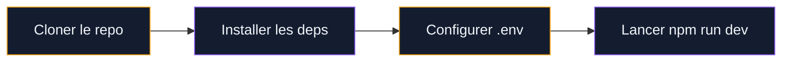

Ce guide vous accompagne dans vos premiers pas. Suivez les etapes ci-dessous pour une mise en route rapide.

## Etape 1 : Installation

Commencez par installer les outils necessaires. Vous aurez besoin de Node.js (v18+) et d'un editeur de code.

> [!TIP]
> Utilisez VS Code avec l'extension Astro pour une meilleure experience de developpement.

## Etape 2 : Configuration

Creez un fichier `.env` a partir du template fourni et renseignez vos cles API.

> [!WARNING]
> Ne committez jamais votre fichier `.env` dans le depot Git. Ajoutez-le a `.gitignore`.

## Etape 3 : Premier contenu

Creez votre premier article dans `src/content/blog/` en suivant le schema du frontmatter.

> [!NOTE]
> Les articles avec une date `pubDate` dans le futur ne seront pas generes au build. Ils apparaitront automatiquement au prochain rebuild apres leur date de publication.

## Questions frequentes

### Comment planifier un article ?

Mettez une date future dans le champ `pubDate` du frontmatter. Le systeme de rebuild automatique (toutes les 6h) publiera l'article au bon moment.

### Comment ajouter un terme au glossaire ?

Ajoutez une entree dans `src/data/glossary-terms.ts` et creez le fichier markdown correspondant dans `src/content/glossaire/`.

> [!IMPORTANT]
> Lancez toujours le script de verification apres avoir ecrit un article : `./scripts/verify-articles.sh mon-slug`
